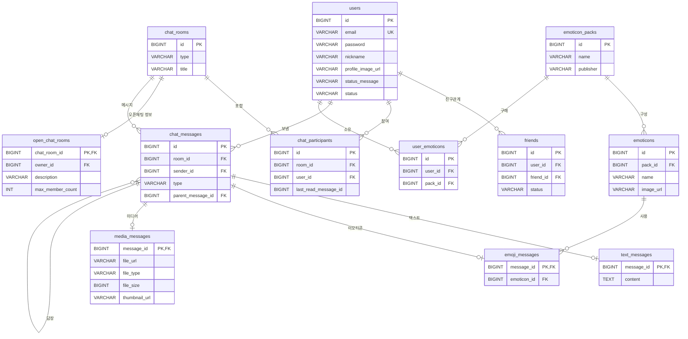

# chat_service

실시간 채팅 서비스 백엔드 (클론코딩 스터디)

## 기술 스택
- Spring Boot 3.5.16 / Java 21 / Gradle
- Spring Data JPA, MySQL
- Spring Security (JWT), WebSocket (STOMP)

## 기능 범위 (카카오톡 기준)
- 회원: 회원가입 / 로그인 / 프로필
- 친구: 친구 요청 / 수락 / 목록
- 채팅방: 1:1 · 그룹 · 오픈채팅방 생성 / 목록 / 나가기
- 메시지: 실시간 송수신(WebSocket) / 채팅 내역 / 안읽음 카운트
- 메시지 종류: 텍스트 / 이모티콘 / 미디어(사진·카메라·파일·음성)
- 답장: 특정 메시지를 지목해 답장
- 이모티콘: 패키지 구매 및 소유 관리

## ERD

정규화(중복 제거)와 상속 매핑(메시지·채팅방 종류 구분)을 반영한 카카오톡 기준 설계.

| 테이블 | 설명 | 설계 포인트 |
|---|---|---|
| users | 회원 | |
| friends | 친구관계 | `user_id`+`friend_id` 유니크 |
| chat_rooms | 채팅방 (부모) | `type`으로 1:1/그룹/오픈 구분 |
| open_chat_rooms | 오픈채팅 전용 정보 (자식) | 상속-조인 전략 |
| chat_participants | 채팅방 참여자 | 회원-채팅방 N:N 해소, `last_read_message_id`로 읽음 처리 |
| chat_messages | 메시지 (부모) | `parent_message_id` 자기참조로 답장, `type`으로 종류 구분 |
| text_messages | 텍스트 메시지 (자식) | 상속-조인 전략 |
| emoji_messages | 이모티콘 메시지 (자식) | 상속-조인 전략 |
| media_messages | 미디어 메시지 (자식) | 상속-조인 전략 |
| emoticon_packs | 이모티콘 패키지 | 3NF 분리 |
| emoticons | 개별 이모티콘 | `pack_id`로 패키지 참조 |
| user_emoticons | 이모티콘 소유 내역 | 회원-패키지 N:N 해소 |

**주요 상태값(enum)**
- `users.status` : `ACTIVE` / `INACTIVE` / `DELETED`
- `friends.status` : `PENDING` / `ACCEPTED`
- `chat_rooms.type` : `SINGLE`(1:1) / `GROUP`(그룹) / `OPEN`(오픈채팅)
- `chat_messages.type` : `TEXT` / `EMOJI` / `MEDIA`
- `chat_messages.parent_message_id` : 답장 대상 메시지 (없으면 NULL)
- `media_messages.file_type` : `IMAGE` / `VIDEO` / `FILE` / `AUDIO` — 사진·카메라·파일·음성메시지를 종류만 나눠 한 테이블로 처리

> **유니코드 이모지(😀)와 카톡 이모티콘은 저장 방식이 다르다.** 휴대폰 기본 이모지는 별도 테이블 없이 `text_messages.content`에 텍스트로 저장하며, 이를 위해 DB 문자셋을 `utf8mb4`로 잡는다. 반면 구매하는 캐릭터 이모티콘은 `emoji_messages`가 `emoticons`를 참조해 처리한다.

---

## DB 설계 핵심 이론 정리

카카오톡 기준으로 ERD를 재설계하기 전에, "테이블을 어떤 기준으로 쪼갤지"를 판단하기 위해 정규화와 상속 관계 모델링을 먼저 정리했다.

### 1. 데이터베이스 정규화

정규화는 데이터 중복과 이상현상을 줄이기 위해, 컬럼 사이의 종속 관계를 기준으로 테이블을 나누는 과정이다.

- **삽입 이상**: 불필요한 데이터가 없으면 새 행을 넣지 못하는 문제
- **갱신 이상**: 중복 저장된 값을 일부만 고쳐 데이터가 서로 안 맞는 문제
- **삭제 이상**: 한 행을 지우면 살려야 할 다른 정보까지 같이 사라지는 문제

정규화는 이 세 가지를 없애는 방향으로 단계적으로 진행된다.

#### 1NF (제1정규형) — 원자값

모든 컬럼이 더 이상 쪼갤 수 없는 하나의 값만 가져야 하고, 여러 값을 한 칸에 몰아넣으면 안 된다.

- **위반 예시**: 단톡방 참여자를 `chat_rooms.participants = "1,2,3"` 처럼 한 컬럼에 콤마로 나열
- **분해**: 참여자를 `chat_participants` 테이블로 분리해서 **한 행에 참여자 한 명**만 저장 → 원자성 확보

#### 2NF (제2정규형) — 부분 종속 제거

1NF를 만족하면서, 기본키가 여러 컬럼으로 된 복합키일 때 **복합키의 일부에만 딸려 있는 컬럼**이 없어야 한다.

- **위반 예시**: `chat_participants(room_id, user_id)`를 복합키로 두고 여기에 `nickname`을 넣으면, `nickname`은 `user_id` 하나에만 딸려 있음
- **분해**: 회원 정보를 `users` 테이블로 옮기고 `user_id`로만 참조
- **참고**: 이런 부분 종속은 복합키에서만 생기므로, 별도의 단일 기본키(`id`)를 두면 애초에 생기지 않는다.

#### 3NF (제3정규형) — 이행 종속 제거

2NF를 만족하면서, 기본키가 아닌 **일반 컬럼끼리 딸려 있는 관계**가 없어야 한다. (A가 B를 정하고 B가 다시 C를 정하는 구조)

- **위반 예시**: `emoticon(id, pack_id, pack_name, publisher)`에서 `pack_id`를 알면 `pack_name`과 `publisher`가 정해짐 → `id → pack_id → pack_name` 으로 한 다리 건너 딸림
- **분해**: 패키지 정보를 `emoticon_pack` 테이블로 옮기고 `emoticon`은 `pack_id`만 참조

#### BCNF

3NF를 만족하면서, **어떤 컬럼을 결정하는 쪽은 반드시 후보키**여야 한다. 3NF까지 맞아도, 후보키가 아닌 컬럼이 다른 컬럼을 정하고 있으면 BCNF 위반이다.

- **예시**: `(학생, 과목)`이 `교수`를 정하고, `교수`가 다시 `과목`을 정하는 경우. `교수`는 후보키가 아닌데 `과목`을 정하고 있으니 위반. 교수-과목 관계를 따로 떼어 해결한다.

#### 테이블 분해 기준 정립

| 상황 | 조치 | 근거 |
|---|---|---|
| 한 칸에 여러 값 / 반복 그룹 | 행 단위로 분리 | 1NF |
| 복합키 일부에만 종속되는 컬럼 | 별도 테이블로 분리 | 2NF |
| 일반 컬럼 간 종속 | 참조 테이블로 분리 | 3NF |
| 결정자가 후보키가 아님 | 결정자 기준으로 분리 | BCNF |

> 단, 정규화가 항상 정답은 아니다. 카톡처럼 조회가 많은 서비스는 정규화를 과하게 하면 조인이 폭발하므로, 안읽음 카운트나 채팅방 목록의 마지막 메시지 같은 값은 의도적으로 반정규화(캐싱)하는 것도 함께 고려한다.

### 2. 상속 관계 모델링

객체의 부모-자식 구조를 관계형 DB 테이블로 옮기는 전략. 카톡에서는 메시지 종류(`ChatMessage` → `TextMessage` / `EmojiMessage` / `MediaMessage`)나 채팅방(`ChatRoom` → `OpenChatRoom`)처럼 부모-자식 구조가 나온다.

| 전략 | 테이블 구성 | 장점 | 단점 | JPA |
|---|---|---|---|---|
| **단일 테이블** | 부모와 자식을 한 테이블에 몰아넣고 구분 컬럼으로 나눔 | 조인이 없어 조회가 빠르고 단순함 | 자식마다 다른 컬럼이 전부 빈 값이 될 수 있어 낭비가 크고 무결성이 약함 | `@Inheritance(SINGLE_TABLE)` |
| **조인 전략** | 부모와 자식을 각각 테이블로 두고 기본키로 이어 조인 | 테이블이 깔끔하고 빈 값이 없어 무결성이 강함 | 조회할 때 조인이 생겨 쿼리가 복잡하고 부담됨 | `@Inheritance(JOINED)` |
| **구현 클래스마다 테이블** | 부모 테이블 없이 자식 테이블만 각각 둠 | 자식 구분이 명확함 | 부모 기준으로 한 번에 조회할 때 여러 테이블을 합쳐야 해서 비효율 | `@Inheritance(TABLE_PER_CLASS)` |
| **(참고) 공통 매핑** | 상속이 아니라 공통 컬럼만 물려줌 | 공통 필드를 간편하게 재사용 | 부모 타입으로 묶어 조회하는 건 불가 | `@MappedSuperclass` |

#### 카톡 적용 결론

메시지는 종류별로 필요한 값이 많이 다르다. (텍스트는 본문, 이모티콘은 이모티콘 번호, 미디어는 파일 주소와 크기) 단일 테이블로 가면 빈 값 컬럼이 잔뜩 생겨 낭비와 무결성 문제가 커지므로, **종류를 구분하면서도 무결성을 지키는 조인 전략**을 선택한다.

- 대신 `created_at`, `updated_at` 같은 **공통 컬럼 재사용**은 상속이 아니라 `@MappedSuperclass`(`BaseEntity`)로 이미 처리하고 있다.

---

## DB 설계 시 고려사항

테이블 구조(정규화·상속)를 넘어서, 실제 카톡 규모로 굴렸을 때를 가정한 설계 판단.

- **조회 인덱스**: 채팅 내역은 "특정 방의 최신 메시지"를 반복 조회하므로, `chat_messages(room_id, id DESC)` 복합 인덱스로 정렬·페이징을 커버한다.
- **대용량 대비**: `chat_messages`는 시간이 갈수록 무한히 쌓이는 테이블이라, `created_at` 기준 월 단위 파티셔닝을 고려한다. (고민 ② 참고)
- **읽음 처리**: 메시지마다 읽음 레코드를 만들면 폭발하므로, 참여자별 `last_read_message_id` 한 값만 저장하는 범위 방식으로 처리한다.
- **삭제 정책(무결성)**: 발신자가 탈퇴해도 대화 맥락은 남아야 하므로, `chat_messages.sender_id`는 회원 삭제 시 함께 지우지 않고 유지한다. (발신자는 "알 수 없음"으로 표시)
- **반정규화**: 채팅방 목록의 "마지막 메시지 / 안읽음 수"는 매번 조인·집계하면 느리므로, 상황에 따라 별도 컬럼이나 캐시로 빼는 것을 고려한다.
- **문자셋**: 유니코드 이모지가 텍스트에 섞여 저장되므로 DB 문자셋을 `utf8mb4`로 지정한다. (기본 `utf8`은 이모지를 저장하지 못한다.)

---

## DB 설계 고민 및 레퍼런스 공유

카카오톡 수준의 대용량·실시간 채팅을 설계하며 마주친 고민 2건과 참고 자료.

### 고민 ① 실시간 전송과 푸시 알림을 어떻게 나눌까 — 접속 상태(presence) 관리

- **배경**: 메시지가 도착했을 때, 받는 사람이 그 채팅방을 보고 있으면 WebSocket으로 실시간 전송하고, 앱을 안 보고 있으면 FCM 푸시 알림을 보내야 한다. 이 분기를 하려면 서버가 "누가 지금 접속 중인지(presence)"를 알아야 한다.
- **고민 지점**: 접속 상태를 어디에 저장할까?
  - 접속/해제가 매우 빈번해서 매번 RDB에 쓰면 부하가 크다 → Redis 같은 인메모리 저장소가 후보.
  - 서버가 여러 대면 사용자가 어느 서버 소켓에 붙었는지도 추적해야 한다 → Redis Pub/Sub으로 서버 간 전파.
  - 즉 presence는 영속 데이터(RDB)가 아니라 **휘발성 캐시로 분리**하는 게 설계 판단.
- **참고 자료**
  - [채널톡 실시간 채팅 서버 개선 여정 — Redis Pub/Sub](https://channel.io/ko/blog/real-time-chat-server-1-redis-pub-sub)
  - [PWA 환경에서 푸시 알림 구현하기 (Spring Boot, FCM, Redis)](https://headf1rst.github.io/TIL/push-notification)
  - [FCM으로 대량 푸시 알림 빨리 보내기](https://velog.io/@koomin1227/FCM-%EC%9C%BC%EB%A1%9C-%EB%8C%80%EB%9F%89-%ED%91%B8%EC%8B%9C-%EC%95%8C%EB%A6%BC-%EB%B9%A8%EB%A6%AC-%EB%B3%B4%EB%82%B4%EA%B8%B0)
  - [Amazon ElastiCache(Redis)로 채팅 애플리케이션 구성하기](https://aws.amazon.com/ko/blogs/korea/how-to-build-a-chat-application-with-amazon-elasticache-for-redis/)

### 고민 ② 무한히 쌓이는 메시지 테이블의 조회·페이징 성능

- **배경**: `chat_messages`는 계속 쌓이기만 하는 테이블이고, 채팅 내역은 "특정 방의 최신 메시지부터 조금씩" 조회하는 패턴이 대부분이다. 데이터가 수억 건이 되면 조회가 급격히 느려진다.
- **고민 지점**: RDB 안에서 이 조회를 어떻게 버틸까?
  - `OFFSET` 페이징은 뒤로 갈수록 앞 페이지를 매번 읽어 느려진다 → 마지막으로 읽은 id를 기준으로 잘라오는 **커서(cursor) 기반 페이징**으로 전환.
  - 정렬·조회에 필요한 컬럼만 인덱스에 담아 테이블 접근을 줄이는 **커버링 인덱스** `(room_id, id DESC)`.
  - 테이블 자체가 너무 커지면 `created_at` 기준 **월 단위 레인지 파티셔닝**으로 조회 범위를 좁힌다.
- **참고 자료**
  - [MySQL 페이징 성능 개선 (커서/NoOffset 방식)](https://velog.io/@ddongh1122/MySQL-%ED%8E%98%EC%9D%B4%EC%A7%95-%EC%84%B1%EB%8A%A5-%EA%B0%9C%EC%84%A0)
  - [커버링 인덱스를 통한 조회 성능 개선](https://tjdtls690.github.io/studycontents/java/2023-11-05-covering_index/)
  - [MySQL Partition 파티션 — 정의와 기능](https://hoing.io/archives/7909)
  - [MySQL 인덱스 성능 개선 — 커버링 인덱스](https://velog.io/@rnjsrntkd95/MySQL-%EC%9D%B8%EB%8D%B1%EC%8A%A4-%EC%84%B1%EB%8A%A5-%EA%B0%9C%EC%84%A0%ED%95%98%EA%B8%B0-%EC%BB%A4%EB%B2%84%EB%A7%81-%EC%9D%B8%EB%8D%B1%EC%8A%A4)
