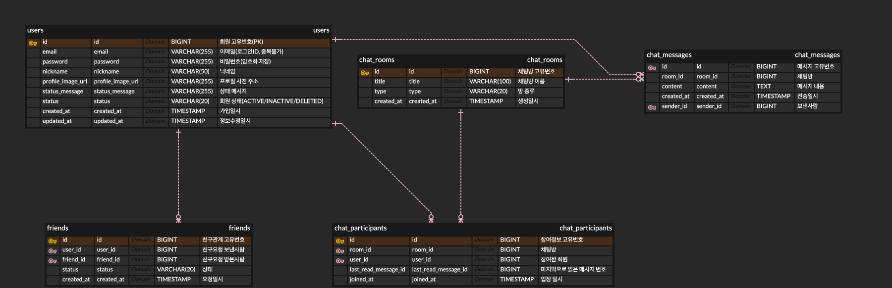

# chat_service

실시간 채팅 서비스 백엔드 (클론코딩 스터디)

## 기술 스택
- Spring Boot 3.5.16 / Java 21 / Gradle
- Spring Data JPA, MySQL
- Spring Security (JWT), WebSocket (STOMP)

## 기능 범위
- 회원: 회원가입 / 로그인 / 프로필
- 친구: 친구 요청 / 수락 / 목록
- 채팅방: 1:1 및 그룹 채팅방 생성 / 목록 / 나가기
- 메시지: 실시간 송수신(WebSocket) / 채팅 내역 / 안읽음 카운트

## ERD

| 테이블 | 설명 |
|---|---|
| users | 회원 |
| friends | 친구관계 |
| chat_rooms | 채팅방 (1:1 / 그룹) |
| chat_participants | 채팅방 참여자 |
| chat_messages | 메시지 |
